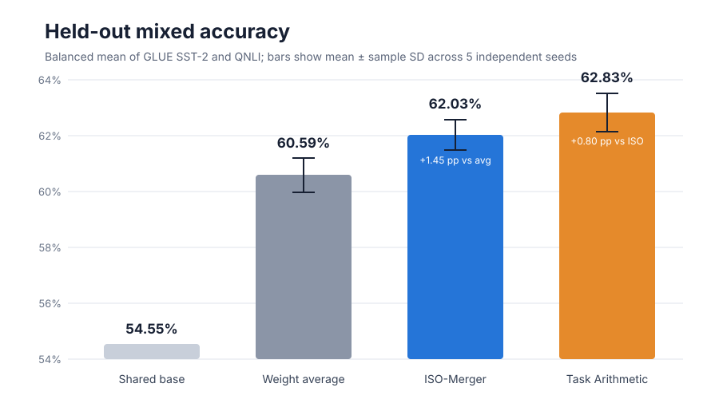

# Reproducing ISO-Merger: exact spectra, mixed functional retention

When several models learn different skills from the same starting point, combining them can erase some of what each learned. The ISO paper proposes merging changes to a matrix’s directions while restoring the original matrix scales, rather than simply adding changed weights. This reproduction asks whether that construction both preserves those scales exactly and retains two complementary public-task specialists better than standard data-free merges.

**Verdict: partially reproduced.** The released construction preserved the base singular spectrum of every two-dimensional parameter within numerical tolerance and outperformed uniform weight averaging. It did not match Task Arithmetic in this bounded setup, and removing either spectrum restoration or the trailing-mode mask slightly improved—not reduced—accuracy.

**Scope.** We substituted a 4.4M-parameter public BERT for the paper’s 1.5B/7B generative models and matched supervised GLUE specialists for its RLVR specialists. This tests the released merger mechanism, not the paper’s absolute benchmark scores or unreleased online optimizer.



Higher is better. Each bar is the mean balanced validation accuracy across five independently trained specialist pairs; whiskers show sample standard deviation. ISO gained 1.45 percentage points over averaging, but Task Arithmetic remained 0.80 points ahead of ISO.

[](https://molab.marimo.io/github/alphaXiv/iso-89fd27c5/blob/main/notebooks/iso_merger_reproduction.py)

## What the paper claims

ISO-Merger decomposes each shared-base matrix as \(W_0=U_0\Sigma_0V_0^\top\). It sign-aligns each specialist’s singular vectors, projects their frame changes into shared tangent spaces, masks the trailing 10% of modes, solves a small system for retention coefficients, retracts the combined frames to orthonormal factors, and reconstructs with \(\Sigma_0\). The paper reports 44.38 average performance for ISO versus 43.52 for its strongest baseline on its two-expert 1.5B setting.

Two selected claims were testable from the release:

| Claim | Paper evidence | Observed evidence | Assessment |
|---|---:|---:|---|
| Reconstructed 2D matrices retain the base spectrum | Exact by construction, up to precision | Worst relative error \(1.04\times10^{-13}\) in float64 and \(1.61\times10^{-8}\) after float32 casting, across 17 matrices × 5 seeds | **Aligned** |
| ISO retains complementary gains at least as well as Task Arithmetic and averaging | ISO leads aggregate merging tables | Mixed accuracy: ISO 62.03%, Task Arithmetic 62.83%, averaging 60.59% | **Partially aligned** |
| Restoration and the 0.9 mask isolate the benefit | Trailing modes described as unstable; base spectrum is central | No restoration: 62.11%; no mask: 62.25%; full ISO: 62.03% | **Not observed in this setup** |

## Controlled public-task test

We initialized one `google/bert_uncased_L-2_H-128_A-2` binary classifier and trained two full-weight specialists from that exact checkpoint: SST-2 sentiment and QNLI entailment. Each used 4,096 public training examples, 160 AdamW steps, the same batch size and learning rate, and disjoint task data. Their held-out accuracies rose from 50.92% to 70.07% on SST-2 and from 58.19% to 69.67% on QNLI, averaged over seeds, establishing real complementary gains before merging.

The implementation keeps the release’s consequential path in float64:

```python
xi_u = project_tangent(u0, ue - u0)
xi_v = project_tangent(v0, ve - v0)
u_star = polar_columns(u0 + project_tangent(u0, sum_c_xi_u))
w_star = (u_star * base_spectrum) @ v_star.T
```

The same checkpoints were merged five ways: released ISO at keep ratio 0.9, ISO without restoration (mean specialist spectra), ISO without masking, Task Arithmetic with \(\lambda=1\), and uniform weight averaging. No evaluation data tuned any merger.


Gain retention normalizes each merged score by the corresponding specialist’s improvement over the base. ISO retained 59.83% on average, substantially above averaging’s 45.12%, but below Task Arithmetic’s 64.68%. The gap came from SST-2: ISO strongly preserved QNLI (mean 69.99%, slightly above its specialist) while retaining little of the sentiment gain.

## Mechanism checks


Every seed passed the preregistered \(10^{-10}\) float64 and \(10^{-5}\) float32 relative-error thresholds. The no-restoration control moved the median matrix spectrum by roughly \(1.15\times10^{-3}\) relative to the largest singular value, so the intervention measurably changed the intended mechanism.


Despite that spectral change, the no-restoration variant exceeded full ISO by 0.07 percentage points on average. Keeping all singular modes exceeded it by 0.22 points. Both directions were positive on all five seeds, so these ablations do not isolate a functional benefit from restoration or masking here. The differences are small, but their consistency argues against claiming the paper’s mechanism was functionally reproduced at this scale.

## Interpretation and limits

The algebraic claim is sharp and survives the substitution: polar-retracted frames reconstructed with the base singular values do retain those values, including after checkpoint casting by a wide margin. The stronger behavioral claim is setup-dependent. These specialists came from short supervised classification updates, not reward-driven generative training; their task vectors interfered asymmetrically, and the tiny model has only 17 two-dimensional parameters. The result therefore says this run did not show ISO’s advantage over Task Arithmetic, not that the paper’s larger RLVR result is incorrect.

A paper-matched reproduction still needs the authors’ 1.5B coding/math or 7B coding/tool/memory checkpoints, their stochastic generation protocols, and the unreleased ISO-Optimizer code for online speedup claims.

## Compute and provenance

All evidence came from fresh OpenResearch Kubernetes runs after the recovery cutoff, on **NVIDIA RTX PRO 6000 Blackwell** GPUs. Peak concurrent allocation was **16 GPUs**; successful jobs used four GPUs each and took 68–83 seconds, while the fresh launch-to-final-evidence campaign elapsed **0.10 wall hours**. Seeds 11, 22, 33, and 55 were repeated exactly and produced identical scores.

Important branches: [seed 11](https://github.com/alphaXiv/iso-89fd27c5/tree/orx/padding-fixed-seed-11), [seed 22](https://github.com/alphaXiv/iso-89fd27c5/tree/orx/padding-fixed-seed-22), [seed 33](https://github.com/alphaXiv/iso-89fd27c5/tree/orx/padding-fixed-seed-33), [seed 44](https://github.com/alphaXiv/iso-89fd27c5/tree/orx/repaired-independent-seed-44), and [seed 55](https://github.com/alphaXiv/iso-89fd27c5/tree/orx/padding-fixed-seed-55). The compact measurements are in [`results/seed_summary.csv`](../../results/seed_summary.csv); the notebook contains the self-contained evidence and calculations.
