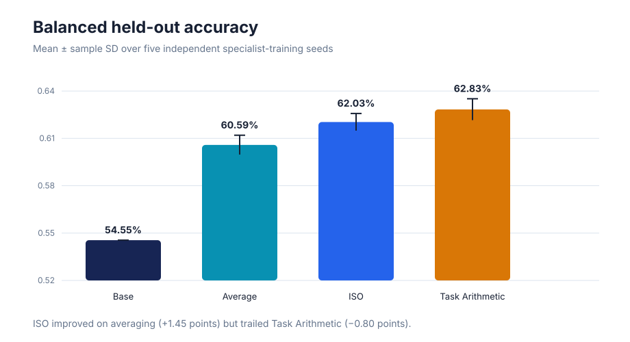
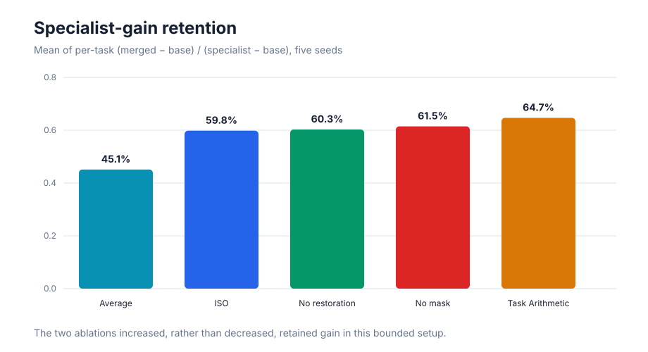
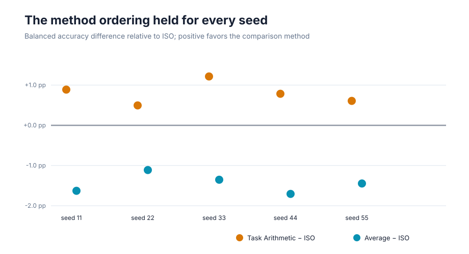
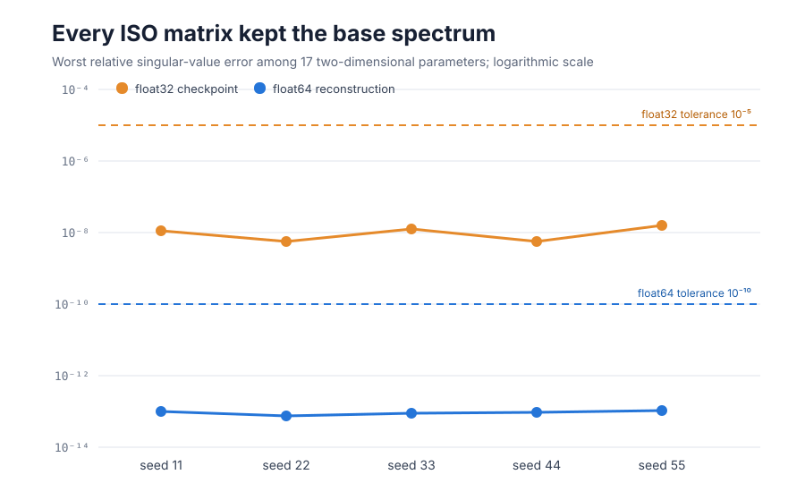
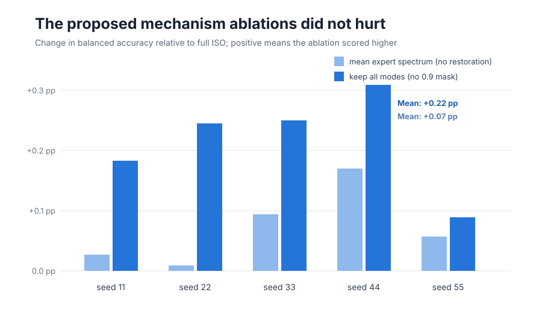

# ISO-Merger: exact spectra, mixed functional evidence

Modern language models can be adapted into specialists, but combining those specialists often damages what each one learned. ISO-Merger proposes to combine changes in a model’s learned directions while restoring the original model’s numerical scales. This reproduction asks whether that construction both preserves those scales and retains two complementary public-task skills better than ordinary checkpoint merging.

**Verdict — partially reproduced.** The sharp mechanistic claim reproduced: all 85 matrix checks preserved the base singular spectrum far inside numerical tolerance. The functional claim did not fully reproduce under this small supervised substitution: ISO beat uniform averaging on all five seeds, but Task Arithmetic beat ISO on all five, and removing either claimed mechanism slightly improved accuracy.

**Scope.** We replaced the paper’s unavailable 1.5B/7B RL specialists with matched full-parameter specialists from one 4.4M-parameter public BERT base, trained on GLUE SST-2 and QNLI. This tests the released merger, not the unreleased online ISO-Optimizer or the paper’s absolute benchmark scores.

Higher bars are better; whiskers show variation across five independent training seeds. ISO reached **62.03% ± 0.54%** balanced accuracy, above uniform averaging at **60.59% ± 0.61%**, but below Task Arithmetic at **62.83% ± 0.68%**.

## What was tested

Both specialists began from the exact same `google/bert_uncased_L-2_H-128_A-2` checkpoint, including an identically initialized classification head. Each received 160 matched supervised steps over 4,096 examples. SST-2 sentiment and QNLI entailment are disjoint public task families with deterministic labels; evaluation used their full validation sets and the balanced mean as the primary mixed score.

For every two-dimensional parameter, the released path was followed in float64: SVD, sign alignment, tangent projection, 0.9 leading-mode mask, unit-retention coefficient solve, polar retraction, and reconstruction with the base spectrum. One-dimensional parameters used task-vector averaging. Baselines used the same checkpoints: Task Arithmetic added both full task vectors with λ=1, while uniform averaging used λ=0.5. The preregistration and exact implementation are in `PROTOCOL.md` and `reproduce.py`.

## Functional retention

The specialists gained 19.15 points on SST-2 and 11.47 on QNLI over the shared base. ISO retained **59.8%** of those gains on average, versus **64.7%** for Task Arithmetic and **45.1%** for averaging. ISO’s outcome was asymmetric: it matched or exceeded the QNLI specialist on most seeds but retained little of the larger SST-2 gain.

The ordering was not driven by one unlucky run. Task Arithmetic exceeded ISO by 0.50–1.21 points on every seed; ISO exceeded averaging by 1.11–1.71 points. Independent Kubernetes reruns of seeds 11, 22, 33, and 55 reproduced the metrics exactly.

## The spectrum claim

This is the clearest reproduction. Across 17 matrices and five seeds, the worst relative singular-value error was **1.04×10⁻¹³** in float64 and **1.61×10⁻⁸** after float32 checkpoint casting, comfortably inside the preregistered 10⁻¹⁰ and 10⁻⁵ thresholds. Reconstructing with the mean expert spectrum instead produced median per-seed drift of **1.15×10⁻³**, confirming that restoration—not an insensitive test—caused the exact preservation.

## Mechanism ablations

The ablations did not isolate a functional benefit here. Removing spectrum restoration raised balanced accuracy by 0.01–0.17 points; retaining all trailing modes raised it by 0.09–0.31 points. These changes are small, but their direction is consistent across seeds and opposite the paper’s stated motivation for the 0.9 mask.

## Claim ledger and interpretation

| Claim | Paper evidence | Observed evidence | Assessment |
|---|---:|---:|---|
| ISO output retains every base matrix spectrum | Fixed by construction, up to numerical precision | 85/85 checks passed; worst float64 error 1.04×10⁻¹³ | **Aligned** |
| ISO retains complementary specialists at least as well as data-free baselines | Two-expert aggregate 44.38 vs 43.52 best baseline | ISO 62.03%, Task Arithmetic 62.83%, average 60.59% | **Partially aligned** |
| Restoration and 0.9 masking explain the benefit | Trailing modes reported unstable; base spectrum reused | Both ablations were slightly better on all five seeds | **Not supported in this setup** |
| ISO-Optimizer accelerates online RLVR | 2.2–2.7× fewer updates in selected settings | Not attempted; code was not released | **Unattempted** |

The result supports the algebraic guarantee and shows a real improvement over weight averaging, but not ISO’s stronger functional comparison. The most important limitation is the substitution: small supervised classifiers may produce task vectors with different geometry from generative RLVR specialists. A full-scale reproduction still needs the paper-matched checkpoints or newly trained RLVR coding/math experts and their generation benchmarks.

All evidence came from OpenResearch Kubernetes on **NVIDIA RTX PRO 6000 Blackwell** GPUs, with **16 GPUs peak concurrent**, four per run. The fresh attempt used **0.12 elapsed wall hours** from first launch through the final terminal evidence; successful scientific phases took 18.9–19.6 seconds each, while end-to-end Kubernetes runs took 68–73 seconds. Key successful branches: [seed 44](https://github.com/alphaXiv/iso-89fd27c5/tree/orx/repaired-independent-seed-44), [seed 11](https://github.com/alphaXiv/iso-89fd27c5/tree/orx/padding-fixed-seed-11), [seed 22](https://github.com/alphaXiv/iso-89fd27c5/tree/orx/padding-fixed-seed-22), [seed 33](https://github.com/alphaXiv/iso-89fd27c5/tree/orx/padding-fixed-seed-33), and [seed 55](https://github.com/alphaXiv/iso-89fd27c5/tree/orx/padding-fixed-seed-55).
